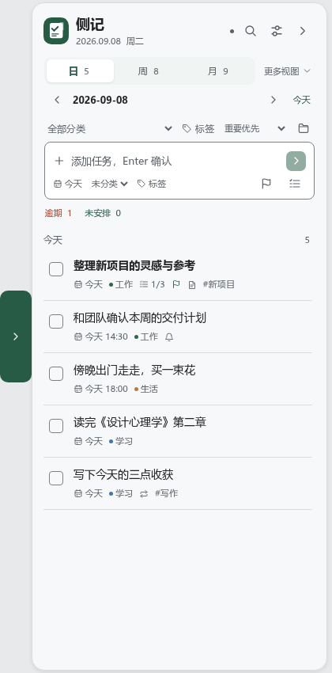
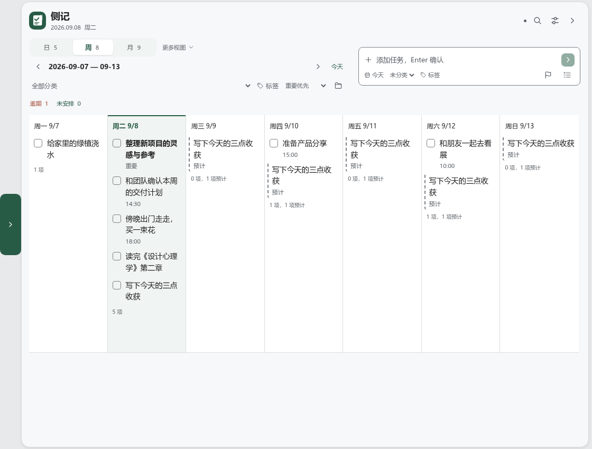
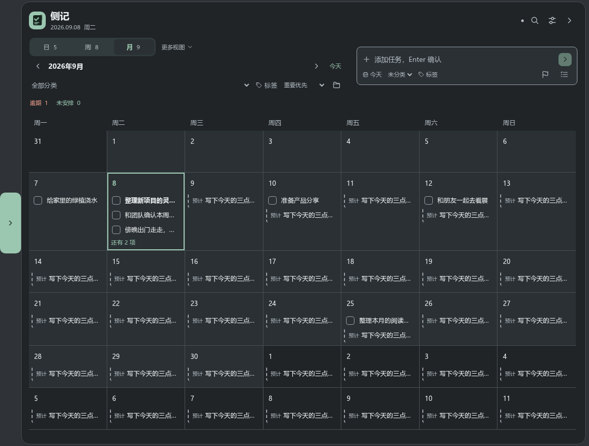
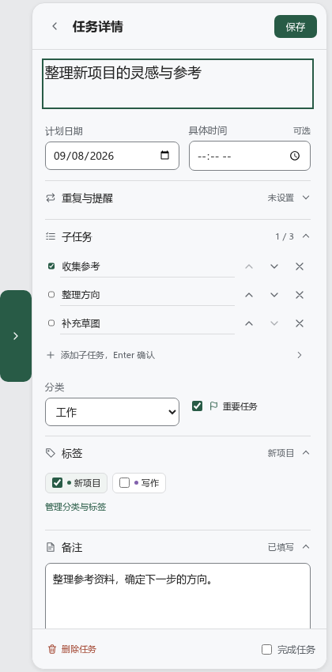

# 侧记 SideTask 1.4.0

一个可自由摆放、闲置时回到桌面边缘的本地任务工具。支持日／周／月视图、四套主题、分类、多标签、子任务、重复任务和到期提醒，无需账户。

## 在 Windows 运行

推荐使用 [Windows 安装版](https://github.com/LJger/sidetask/releases/download/v1.4.0/SideTask-Setup-1.4.0-x64.exe)。也可将 [便携版](https://github.com/LJger/sidetask/releases/download/v1.4.0/SideTask-Portable-1.4.0-x64.exe) 放到 Windows 本地目录运行。两者均无需 Node.js；安装包会在缺少 WebView2 时联网补装，已有 WebView2 时无需下载运行时。完整发布文件和校验文件见 [1.4.0 发布页](https://github.com/LJger/sidetask/releases/tag/v1.4.0)。

1.3 改用 Tauri 与系统 WebView2，大幅缩小应用包。收起后仅显示待办数量，整个数字把手都能拖动；切换窗口后立即开始收起动画。1.3.1 增加收起图标透明度设置，并修正收起收尾和连续反向操作时的图标定位与动画时序。1.3.2 修正展开中点击外部后，再点图标被焦点恢复和点击重复切换的问题，并为未启动的原生拖动请求增加超时恢复。1.3.3 调整收起时的窗口裁剪和拖动坐标处理。1.3.4 增加面板透明度和显示已完成任务设置，优化日历操作，并改进窗口更新与焦点处理。1.3.5 修正展开、收起时系统窗口边框闪现的问题。1.4.0 新增展开方式设置，完善勾选、行进出与弹层动效，提升渲染性能，并增加行空白处打开详情、Ctrl+Enter 保存和方向键遍历列表。升级前请保存草稿并从托盘退出旧版。本轮发布验证见 [1.4.0 验证记录](docs/verification-1.4.0.md)，历史记录见 [1.3.5 验证记录](docs/verification-1.3.5.md)、[1.3.4 验证记录](docs/verification-1.3.4.md)、[1.3.3 验证记录](docs/verification-1.3.3.md)、[1.3.2 验证记录](docs/verification-1.3.2.md)、[1.3.1 验证记录](docs/verification-1.3.1.md) 和 [迁移验证记录](docs/verification.md)。

源码运行需要 Node.js **22.12 或更高版本**、Rust **1.98 或更高版本的 MSVC 工具链**，以及 Visual Studio C++ Build Tools。在 Windows 本地目录执行：

~~~powershell
npm ci
npm start
~~~

也可以双击 start-windows.cmd。从 WSL 复制源码到 Windows 时，不要复制 node_modules，请在 Windows 重新运行 npm ci。

## 自由移动与四边停靠

- 按住标题文字或标题栏空白处拖动，可将展开的窗口放到桌面上的其他位置，支持跨显示器移动。
- 开启“自动停靠”后，切换到其他窗口会**立即开始**贴边和收起动画；自动收起途中重新获得焦点会取消收起。
- 四边统一使用 40×40 DIP 数字把手，显示全部未完成父任务数量：0、1–99 或 99+。单击展开，按住整个把手拖动；松手后吸附目标显示器的最近边缘。支持沿边移动、换边和跨屏，位置随拖放保存。
- 正在拖动、输入法组合输入、存在未保存草稿、执行保存或打开弹层时暂停自动停靠。保护结束后，如果窗口仍失焦，会立即开始收起。
- 手动收起保留当前会话中的草稿；退出程序前仍需保存。
- 日视图目标尺寸为 420×850，周／月视图为 1120×850，实际尺寸根据显示器工作区调整。切换视图时，浮动窗口保持中心，停靠窗口保持边缘位置。
- 位置随稳定的拖放、停靠操作保存；重启恢复。显示器被移除或工作区改变时重新约束位置，避开任务栏。
- 把手在原显示器展开；托盘和全局快捷键使用鼠标所在显示器。“设置 → 窗口行为 → 重置窗口位置”回到主显示器右侧中间。
- 收起展开支持连续反向操作，并尊重系统的“减少动态效果”设置。

设置中可以关闭自动停靠、调整置顶和开机启动。开机启动仅在 Windows 打包版本中可用，启动后保持收起状态。Alt+F4 会收起，彻底退出请使用托盘菜单。

“设置 → 外观”可以调整收起图标的透明度，默认 20%，范围 0%–80%（0% 为不透明）。数字和背景一起变淡，悬停、键盘聚焦或拖动时恢复清晰；更改会自动保存。

1.3.4 支持独立调整“面板透明度”：默认 0%，范围 0%–80%，面板背景、文字、按钮和弹层一起变淡，调整时即时预览并自动保存。

“设置 → 外观 → 展开方式”可以选择侧栏出现的动态效果：**滑入**（默认，从边缘平移进入）、**淡入**（原地浮现）、**弹出**（从把手一侧放大）、**展帘**（从把手一侧展开）。四种方式共用同一套开合时序，支持连续反向操作，并同样遵循系统的“减少动态效果”设置。

## 日、周、月安排

| 视图 | 内容与操作 |
| --- | --- |
| 日 | 所选日期的任务清单，支持列表内完成、改期和展开子任务 |
| 周 | 周一至周日七列清单，点击日期或列内空白处选择新增任务的归属日 |
| 月 | 六周日历网格，点击日期或格内空白处选择日期；每格最多显示三项，“还有 N 项”打开当日清单 |
| 全部任务／全部待办 | 通过“更多视图”查看任务，随“显示已完成”开关切换 |
| 已完成 | 通过“更多视图”查看完成记录，可重新打开 |

上一周期、下一周期和“今天”按钮用于导航，也可点击日期标题选择跳转日期。日／周／月切换保留所选日期和筛选条件；启动时使用记忆的日历模式，并选中今天。主动浏览其他日期时，跨午夜不会打断浏览。

“逾期”和“未安排”入口随时可用。小屏幕下日历内容可以滚动，导航和工具栏保持可操作。日列表按批次显示，周视图每列先显示 50 条。

快速添加输入名称后按 Enter；空白草稿继承所选日期、分类和标签。已有草稿不会随筛选或日期导航被改写。保存到当前范围以外时，提示目标日期并提供“查看”入口。

1.3.4 默认开启“显示已完成”，日／周／月、全部任务和未安排视图可同时显示待办与完成记录，待办排在前面。开关会保存并与搜索共用；“已完成”视图始终只显示完成记录，“逾期”始终只显示未完成任务。任务上的完成、编辑和新增按钮保持独立操作。

搜索可在“当前视图”和“全部任务”（关闭“显示已完成”时为“全部待办”）之间切换。搜索支持名称、备注、子任务以及分类、标签名称。

## 主题与阅读

提供 **松绿、雾蓝、暖沙、石墨** 四套主题，以及“跟随系统”。跟随系统在浅色模式使用松绿，在深色模式使用石墨。

应用图标采用记事页与侧边书签，提供 SVG 源图、512px PNG、托盘图标和 16–256px 八档 Windows ICO；界面操作图标统一使用圆角线条，并随主题调整颜色。

在设置中选择即生效并保存，切换主题保持窗口位置和当前草稿。任务、输入框、把手、弹层、焦点、滚动条和提示共享语义配色；字体与操作位置保持一致。

日列表使用 14px 任务名称与更清楚的辅助文字，完成操作有独立点击区域。日历中的“预计”有文字和虚线标识，状态同时通过文字或图形表达。

## 详情、分类与子任务

点击任务进入详情。日视图在原窗口内编辑，周／月视图在右侧打开详情。日期、时间与提醒集中设置，分类、标签、子任务和备注均可编辑。返回后保留列表位置和筛选。

- 一个任务归属一个分类，可以添加多个标签。多选标签筛选表示同时包含这些标签。
- 筛选栏的文件夹按钮管理分类和标签，支持新建、改名、选色和删除。删除分类后任务转为未分类；删除标签只解除关联。
- 子任务是一层清单，可增删、改名、调整顺序和勾选。完成父任务会完成子任务；子任务全部勾选后仍需手动完成父任务。
- 待办数量只统计父任务。重要、时间和创建顺序的排序在各日期内部生效。
- 详情中的完成状态随保存提交，按钮会明确显示“保存并完成”或“保存并重新打开”。
- 离开未保存的详情时可以继续编辑、放弃或保存。完成和删除提供 10 秒撤销入口；保存失败保留草稿。

## 重复任务与计划预览

重复支持每天、工作日、每周、每月，可设置结束日期。**完成当前实例后才生成下一次，同一系列只有一个未完成实例。**

下一次沿原日历节奏，取晚于原计划日与完成当天的日期，跳过遗漏周期。例如 9 月 7 日的每天重复任务在 9 月 10 日完成，下一次为 9 月 11 日。每月 31 日遇到短月时落在月末，后续仍以 31 日为基准。

日历会提前展示可见范围内的后续重复日期：

- “预计”是只读预览，不写入任务文件，不计入真实待办，也不发送提醒。
- 点击预览可以查看预计日期和规则，或进入当前任务修改设置。
- 完成、改期、删除或调整重复规则后，预览重新计算。真实记录优先，同系列同日去重。
- 预览在后台 Worker 中计算，快速切换日期时不会套用旧结果。

新实例继承分类、标签、备注、时间和提醒，并重置子任务。修改未完成实例影响后续安排；删除它会停止系列。撤销完成会同时移除新生成的实例；如果该实例已经修改，会保留现有内容并提示冲突。从历史重新打开重复任务时，它会恢复为普通任务。

## 到期提醒

设置日期和具体时间后，可开启准时、提前 15 分钟或提前 1 小时提醒。新设置的提醒时间必须在未来。

程序运行、收起或驻留托盘时均可提醒；完全退出后不发送通知。下次启动或休眠恢复时，合并提示错过的提醒。已触发记录持久化，重复检查或重启不会重复发送同一次提醒。

改期、完成、删除同步更新调度。点击通知展开相关任务，未保存编辑会先受到保护。Windows 通知设置和勿扰模式可能影响横幅显示；通知调用失败时，应用保留提示和查看入口。

## 数据与升级

Windows 数据通常位于：

~~~text
%APPDATA%\SideTask\tasks.json
~~~

“设置 → 打开数据文件夹”可定位实际目录。安装版、便携版和源码版默认共享该用户数据目录；便携版不把数据放在可执行文件旁边。

1.3 继续使用 **v3 数据格式**，数据目录与旧版相同。首次读取旧版数据时另外保留 tasks.pre-tauri.json，后续写入不会覆盖这份迁移前备份。首次加载 v1／v2 时自动升级，保留任务内容、编号、分类、标签、子任务、重复与提醒。新增主题、日历和位置设置使用默认值，旧版左右停靠设置映射到对应边缘。

升级前独立保留 tasks.v1-original.json 或 tasks.v2-original.json，后续保存不会覆盖它们。旧程序会拒绝加载 v3，使用旧版本时应使用对应的原始备份。未知未来版本同样停止加载，避免覆盖。

每次写入先保存临时文件，再原子替换；tasks.backup.json 保留上次数据。损坏的原文件会独立保留，再尝试恢复备份。

导出备份使用 v3；导入接受 v1／v2／v3，合并任务与分类标签，保留本机外观、窗口和启动设置。同编号任务保留本地内容，同名分类标签复用，重复系列不会导入第二个未完成实例。

名称最多 160 个字符、备注 2,000 个字符、每个任务最多 100 个子任务、最多 10,000 个父任务，导入文件不超过 10 MB。浏览器预览使用独立的本地存储，旧数据升级也保留原始副本；多个标签页之间同步并拒绝过时编辑。草稿只在当前会话中保留。

## 快捷键

| 快捷键 | 操作 |
| --- | --- |
| Ctrl + Shift + Space | 全局展开／收起 |
| Ctrl + N | 聚焦快速添加 |
| Ctrl + F | 搜索 |
| Enter | 添加任务或子任务；列表中焦点在任务上时打开详情 |
| Ctrl + Enter | 在详情中保存 |
| Esc | 关闭弹层、返回列表、关闭搜索，最后才收起 |
| 方向键／Home／End | 在获得焦点的日／周／月标签间切换，或在任务列表中逐行移动 |

## 开发与验证

~~~sh
npm ci
npm run preview
npm run check
npm test
npm run test:native
npm run test:ui
npm run test:desktop
node scripts/capture-preview.mjs
~~~

预览地址为 http://127.0.0.1:4173。截图脚本需要先启动预览服务，使用独立演示数据，不影响日常任务。

Linux／WSL 可以运行浏览器预览、JavaScript 测试和 Rust 核心测试。Playwright 需要 Chromium 及其系统库，可通过 npx playwright install --with-deps chromium --only-shell 准备。桌面测试在 Windows 使用 WebdriverIO 与匹配 WebView2 版本的 EdgeDriver，通过本机临时端口连接测试程序，全部使用独立临时数据目录。

Windows 上先准备对应版本的 EdgeDriver。以下命令验证已打包程序，包括实际鼠标拖动和各档缩放：

~~~powershell
$env:SIDETASK_EDGE_DRIVER = powershell -ExecutionPolicy Bypass -File scripts/setup-webdriver.ps1
powershell -ExecutionPolicy Bypass -File scripts/verify-windows.ps1 -Executable src-tauri/target/x86_64-pc-windows-msvc/release/SideTask.exe -NativeDrag -AllScales
powershell -ExecutionPolicy Bypass -File scripts/verify-windows.ps1 -Executable release/SideTask-Portable-1.4.0-x64.exe -Portable
~~~

原生鼠标测试会短暂移动鼠标并恢复原位置。通知通常被测试替身捕获；额外设置 SIDETASK_TEST_NATIVE_NOTIFICATIONS=1 可验证一次真实系统通知并清除。

1.3.4 的窗口更新集中在 UI 线程执行，合并连续移动事件，对失败更新延迟重试，并避免使用可能模拟 Alt 键的焦点恢复路径。1.3.5 在首次显示前清除系统标题栏与边框样式，并过滤运行时对窗口样式的重写，展开、收起时不再闪现系统边框；桌面测试可通过 `SIDETASK_TEST_FRAME_STRESS=1` 运行原生边框回归长测，详见 [窗口边框验证记录](docs/verification-window-frame.md)。原生鼠标测试还覆盖收起后的四个边缘和展开面板外部的点击、滚轮、右键菜单与前台焦点。代码审查无法确认 Edge 收藏夹或 Nexus 的偶发问题已经消失，仍需在受影响的 Windows 环境验证。

排查窗口问题时，可在启动前设置环境变量 `SIDETASK_DIAGNOSTICS=1`。数据目录中的 `window-diagnostics.jsonl` 记录窗口事件、更新耗时和错误，不记录任务内容；文件最多约 1 MiB，达到上限后从头写入，每次启动重新记录。默认关闭。

最新构建与基础验证见 [1.4.0 验证记录](docs/verification-1.4.0.md)，历史平台覆盖见 [迁移验证记录](docs/verification.md)。设计依据保留在 [frontend-design 复查](docs/frontend-design-review.md)。

界面继续使用原生 HTML／CSS／JavaScript，静态打包仅复制 src 和 assets。Rust 后台串行处理任务、原子保存、窗口状态和提醒；界面通过白名单 IPC 调用后台。浏览器预览保留 JavaScript 模型，共用契约样例校验两套业务实现一致。打包不包含 Node.js、Chromium、测试依赖或开发工具。

## 打包

~~~powershell
npm run build:portable
npm run build:win
~~~

推荐在 Windows 本机或 Windows CI 构建，输出位于 release，同时生成 SHA-256 校验文件。Rust 发布配置启用 LTO、体积优化与静态 C 运行库，无需额外安装 VC++ 运行库；程序尚未配置代码签名。Linux／WSL 可使用 cargo-xwin 与 NSIS 交叉构建，生成后仍需 Windows 实测。
